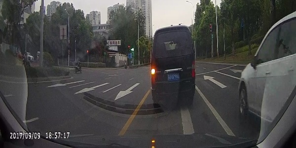
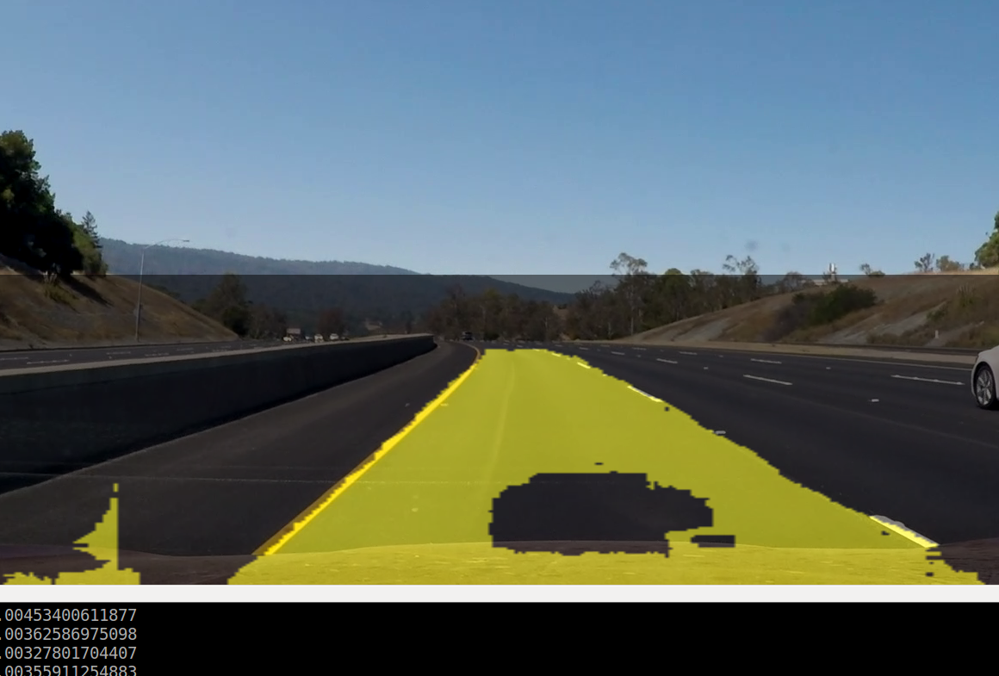
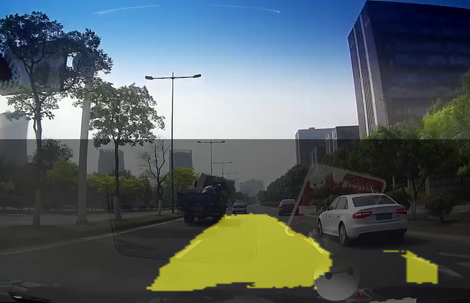
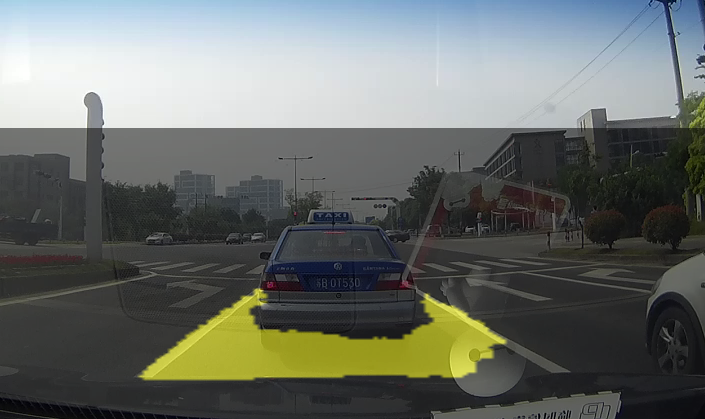

# VehicleLaneDetect
A easy way to detect vehicle lane,Use cnn by keras to detect vehicle lane,the model size is small
***
## 1.run  
python LaneDetect.py
## 2.train   
I use 300*150 resolution image to train,about 2000 images,the model is end-2-end:  

## 3.result images

***   

## 4.welcome to discuss

