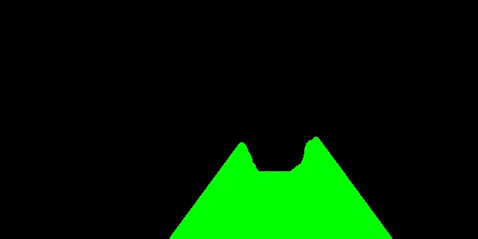

# VehicleLaneDetect
Use cnn by keras to detect vehicle lane
***
##1.run  
python LaneDetect.py
##2.train   
I use 300*150 resolution image to train,about 2000 images,the model is end-2-end:  
   

##3.result images
   
  
   
***

